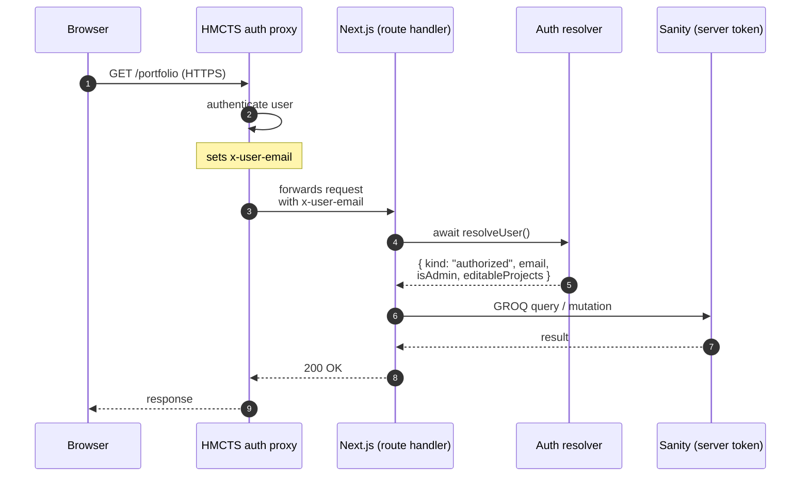

# Auth flow

Two flows. The contract downstream of the auth resolver is identical in both cases — every API route reads `x-user-email` from the request headers — but the source of that header differs.

## Production: upstream proxy



In production the portal has no notion of how the user authenticated. It trusts the `x-user-email` header because the proxy is the trust boundary in front of every request. The smoke test at `tests/api-auth-contract.test.ts` enforces that no API route can be reached without that header — a misconfigured route that leaks past the proxy fails CI.

## Preview / local: in-process middleware

When `APP_ENVIRONMENT` is `preview` or `local`, the upstream proxy doesn't exist. The Edge middleware substitutes for it.

```mermaid
sequenceDiagram
    autonumber
    participant U as Browser
    participant M as Edge middleware
    participant E as /preview-auth page
    participant N as Next.js (route handler)
    participant R as Auth resolver

    U->>M: GET /portfolio (no cookie)
    M->>M: strip any inbound x-user-email
    M-->>U: 302 → /preview-auth?next=/portfolio
    U->>E: GET /preview-auth
    E-->>U: email-entry form
    U->>E: POST email
    E->>E: HMAC-sign cookie<br/>(PREVIEW_AUTH_COOKIE_SECRET)
    E-->>U: Set-Cookie previewAuth;<br/>302 → /portfolio
    U->>M: GET /portfolio (with cookie)
    M->>M: verify HMAC; extract email
    M->>N: forwards with<br/>x-user-email injected
    N->>R: await resolveUser()
    R-->>N: { kind: "authorized", ... }
    N-->>U: 200 OK
```

Key invariants:
- **Inbound `x-user-email` is always stripped** before the cookie's email is injected. A client cannot spoof identity by setting the header directly.
- **Cookie max-age ≤ 7 days.** After expiry the cycle restarts at `/preview-auth`.
- **Production safety:** the middleware short-circuits when `APP_ENVIRONMENT=production` and `/preview-auth` returns 404. CI fails the production build if the preview-auth bundle leaks.
- **Audit:** first sign-in per email writes a `previewSession` document; subsequent sign-ins update `lastSeenAt`.

See `openspec/specs/preview-auth/spec.md` for the full contract.
