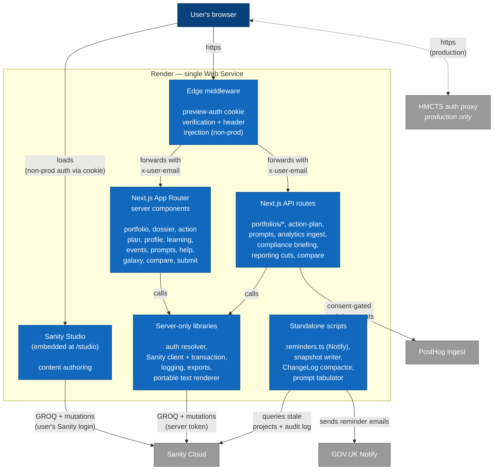

# Containers

C4 level 2. What runs inside the portal and how those pieces talk to each other and to external systems.

## What lives where

- **Edge middleware** — `middleware.ts`. Active when `APP_ENVIRONMENT in {preview, local}`; inert in production. Generates `requestId`, sets `x-user-email` from the signed `previewAuth` cookie, redirects to `/preview-auth` when missing.
- **Pages** — `app/(app)/**` (everything wrapped in the sidebar shell), plus the sign-in page at `/preview-auth` and the embedded Studio at `/studio`. Server components by default; small client components for interactive bits (filters, dropdowns, edit forms).
- **API routes** — `app/api/**`. Every route's first executable line is `await resolveUser()`. All mutations go through `commitWithChangeLog()` which writes one ChangeLog row per modified field in the same Sanity transaction.
- **Server-only libraries** — `lib/**` modules that import `'server-only'`. Imports of these from a client component fail at compile time.
- **Studio** — embedded via `next-sanity/studio` at `/studio/[[...tool]]/page.tsx`. User signs in with their Sanity account; not gated by `x-user-email`.
- **Standalone scripts** — `scripts/**`. Run on a scheduler (cron / CI). Use the same Sanity client and the same logger as the in-process app.

## What's NOT in this diagram

- **Render's own infrastructure** (load balancers, build pipelines, secrets store) — not portal-specific; see `deployment.md` for the deployment-side view.
- **Browser-side analytics SDK loading** — handled by the `lib/analytics/client.ts` module after consent; the events flow into the Next.js `/api/analytics/ingest` proxy when `ANALYTICS_INGEST_MODE=proxy`, otherwise direct to PostHog.
