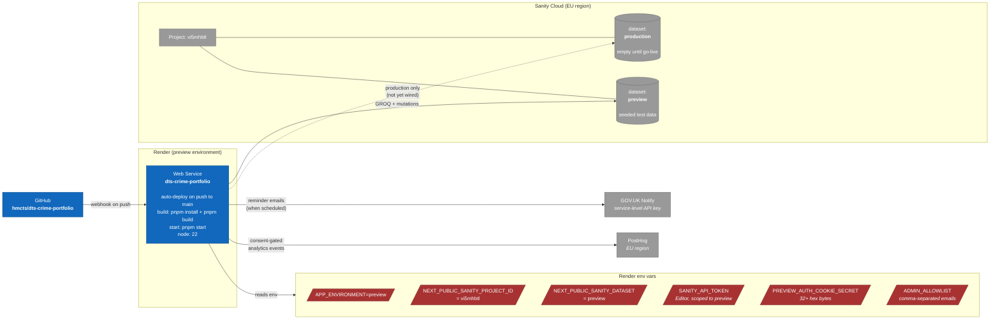

# Deployment

Where each piece runs at v1 launch.

## Environment isolation

Two Sanity datasets in the single project (`vi5mhbtl`):

- **`preview`** — used by Render preview deploy, local `pnpm dev`, and any future test environments. Seeded test data only; never holds real DTS Crime project records.
- **`production`** — created but unused until production launch. The production deploy will be a separate Render service (or replacement HMCTS-hosted target) with its own env-var bundle.

The `SANITY_API_TOKEN` issued for the preview service is scoped to the `preview` dataset. If the token leaks, the blast radius is test data only.

## Render specifics

- **Build:** `pnpm install --frozen-lockfile && pnpm build`. Requires `corepack enable` if pnpm isn't pre-installed in the build image.
- **Start:** `pnpm start`. Bound to Render's auto-assigned port via `process.env.PORT`.
- **Free Starter plan caveat:** sleeps after 15 minutes of inactivity. First request after a sleep takes ~30s to wake. Acceptable for a feedback preview; not acceptable for production.
- **Custom domain:** none yet; default `<service>.onrender.com` is fine for the preview audience.

## What's NOT in this diagram

- **Production deployment topology** — to be drawn when production hosting is decided. Could be Render Pro, Azure App Service (HMCTS norm), or an HMCTS-managed AKS cluster behind their identity proxy.
- **DNS, certificate management, WAF** — Render-managed at preview. Production will have its own piece of this story.
- **The auth proxy** — production-only and not in scope for this preview-environment diagram. See `auth-flow.md` for the request-level role it plays.
- **Backup and restore** — Sanity Cloud handles this for the dataset; we don't have a separate plan yet.
