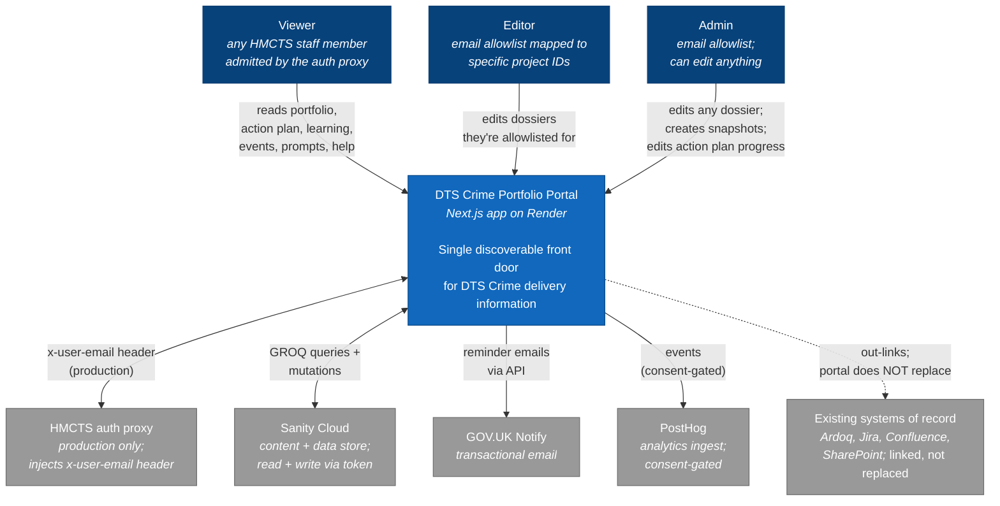

# System context

C4 level 1. The Crime Portfolio in its environment — the people who use it, the systems that surround it, the high-level data flow.

## Notes

- **Production identity** flows from the HMCTS auth proxy as an `x-user-email` header per request. The portal stores no sessions and no tokens.
- **Preview-auth** is a non-production middleware that synthesises the same `x-user-email` header from a signed cookie set after a simple email-entry page. See `auth-flow.md`.
- **Data sovereignty** — Sanity Cloud is hosted in the EU region for the preview dataset. Production-region choice deferred until production launch (see `decisions/` for the decision when made).
- **The portal is a front door, not a system of record.** Project rosters, delivery details, and operational documentation live elsewhere; the portal aggregates and links.
